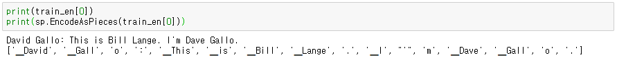
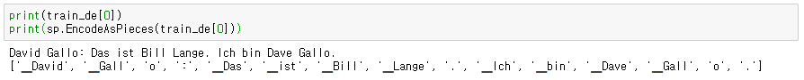
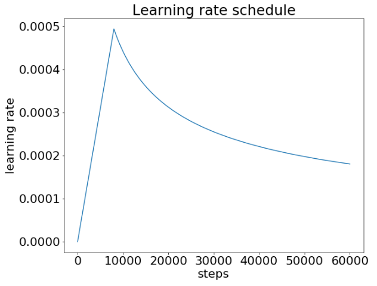
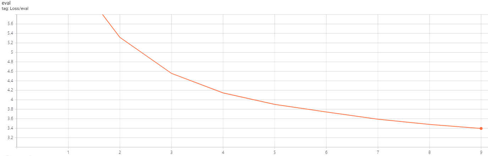
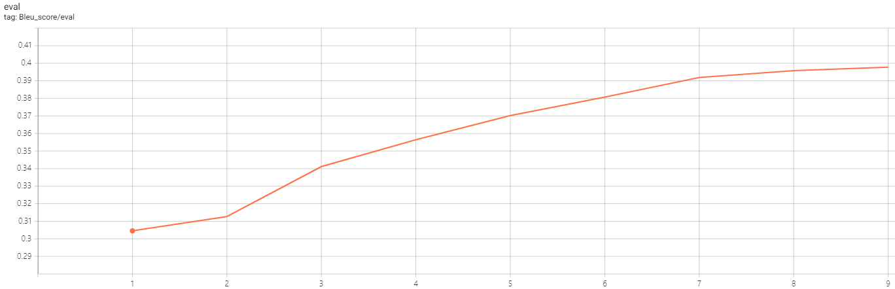

# Machine-Translation
## Transformer를 사용한 영어 => 독일어 번역

### 1. IWSLT 2016 영어-독일어 데이터

2016년 IWSLT에서 사용한 English-German 번역 데이터를 사용

약 20만개의 영어-독일어 학습 데이터 쌍과 약 1000개의 검증 데이터 쌍을 사용

[IWSLT 2016 영어-독일어 데이터](https://wit3.fbk.eu/download.php?release=2016-01&type=texts&slang=de&tlang=en)


### 2. SentencePiece를 사용해 문장 토큰화

Google의 [SentencePiece](https://github.com/google/sentencepiece)를 사용해 영어와 독일어 문장들을 토큰화함





\<PAD\>, \<UNK\>, \<S\>,\</S\> 토큰들을 포함해 총 32000 크기의 단어 사전을 생성

만든 사전으로 데이터들을 모두 토큰으로 전처리한 후에 pytorch의 Dataset과 DataLoader로 데이터를 읽음


### 3. Transformer 모델 사용

Pytorch로 [Attention is all you need](http://papers.nips.cc/paper/7181-attention-is-all-you-need)에서 소개된 transformer 모델을 구현

\<PAD\> 토큰에 masking을 적용해 attention score를 계산할 때, query가 key의 \<PAD\> 토큰에 관여하는 것을 막음


### 4. 모델 학습

Learning rate scheduling은 warmup과 noam decay 방식을 사용



검증 데이터에서 아래와 같은 loss를 기록




### 5. 모델 검증

nltk에서 제공하는 bleu score를 사용

Bleu score를 계산할 때, smoothing을 적용해 짧은 길이의 문장들에 대한 score를 보정

검증 데이터에서 아래와 같은 bleu score를 기록




### 6. 사용법

1. 데이터 다운 & 디렉토리 추가

   ```
   bash download.sh
   ```

   IWSLT 2016 데이터를 다운받고 디렉토리들을 추가

2. 데이터 전처리

   ```
   python preprocess.py
   ```

   SentencePiece를 학습시키고 사전을 생성

   만들어진 사전으로 데이터들을 전처리

   ```
   python preprocess.py --vocab_size 10000
   ```

   사전의 크기를 조정 가능(기본값: 32000)

3. 모델 학습 & 검증

   ```
   python train.py
   ```

   Transformer 모델을 생성하고 전처리된 데이터를 읽어와 모델을 학습

   `config.py`에 명시된 하이퍼파라미터들을 조정 가능

   